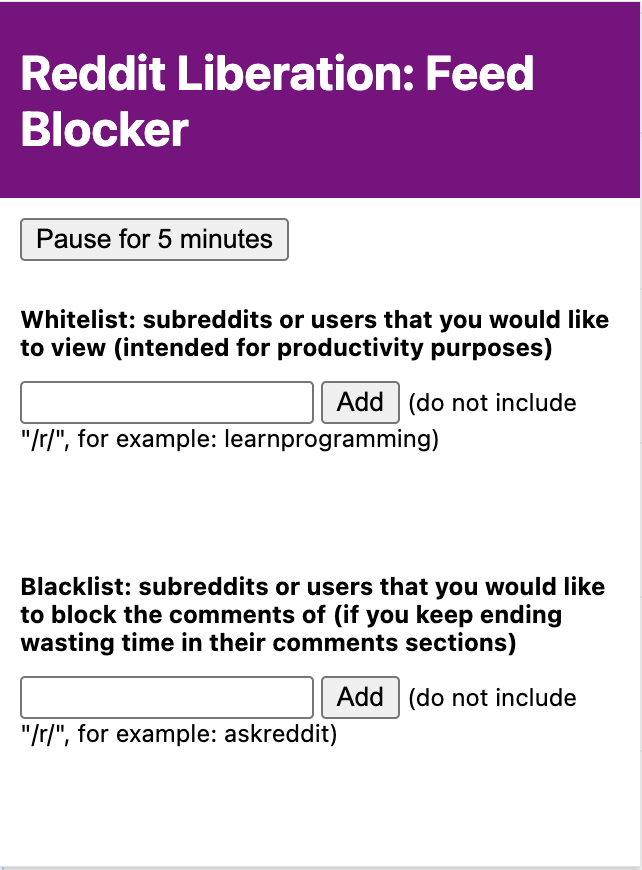
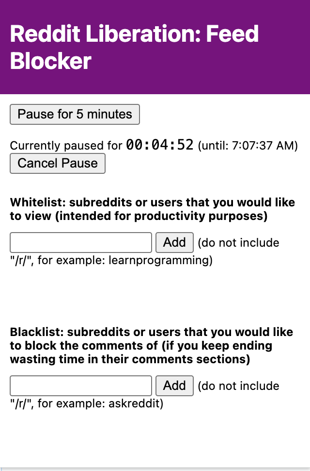

# reddit-liberation-extension
> [!NOTE]
> This is a fork of the [original](https://github.com/HZ757/reddit-liberation-extension) that I created so that I could add some functionalities.
> To see what new features I have added and how the extension looks like now, click here.

A Chrome Extension for reddit users to minimize lost productivity on reddit. Current Users: 40+

Features:
- blocks infinite feeds
- custom content filters (whitelist and blacklist)

# Screenshots
## How the UI looks

## Once the "Pause" button is pressed, it looks like:

